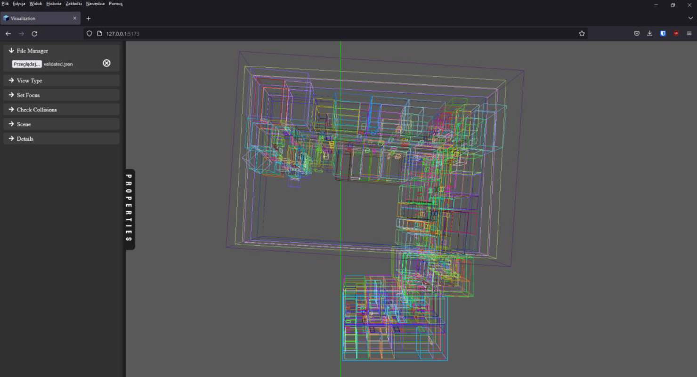
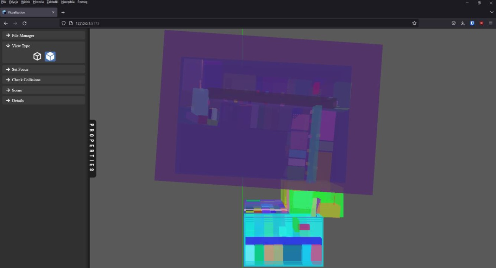
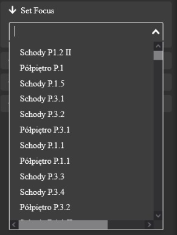
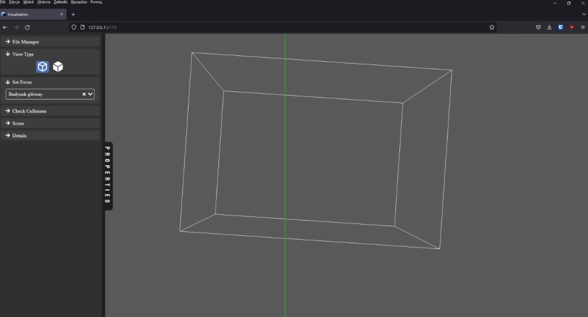
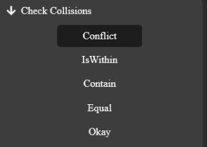
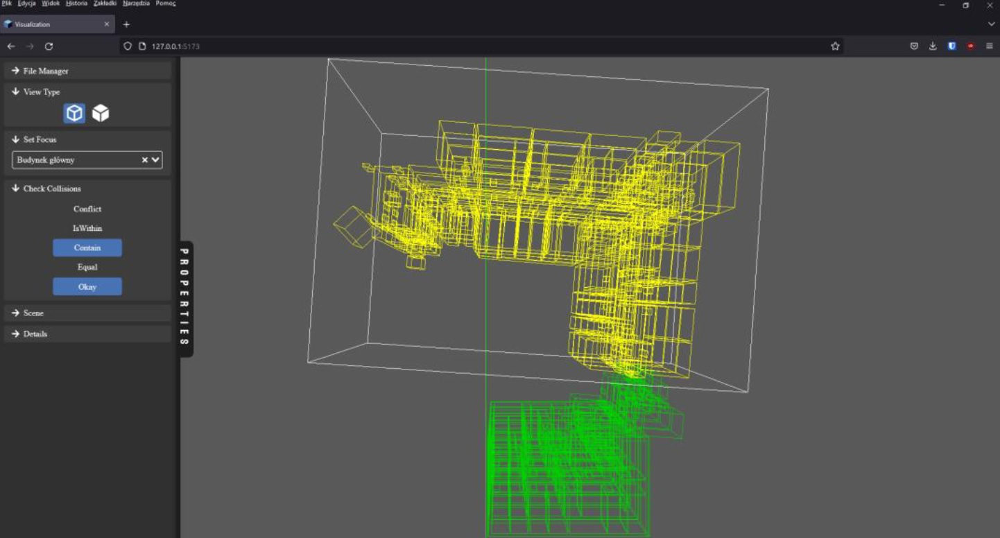
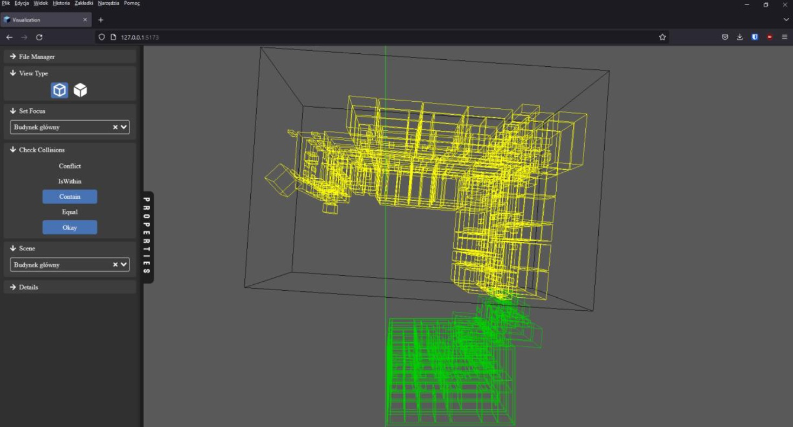
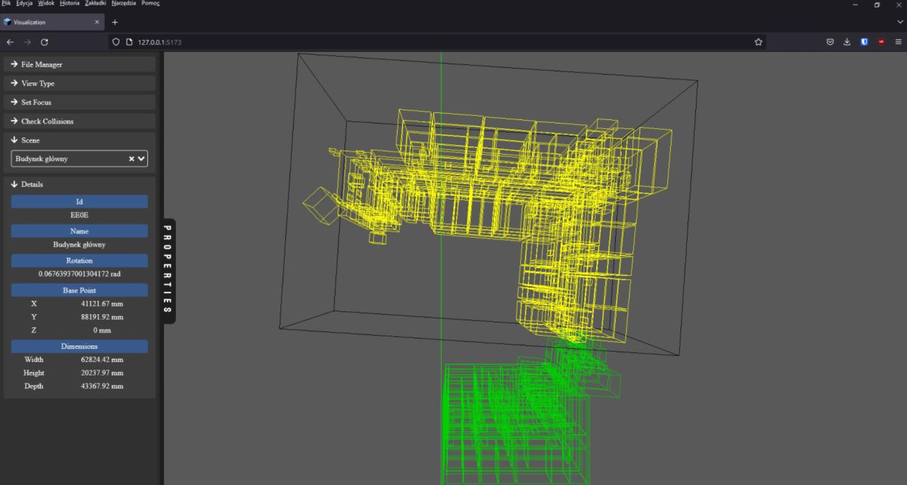
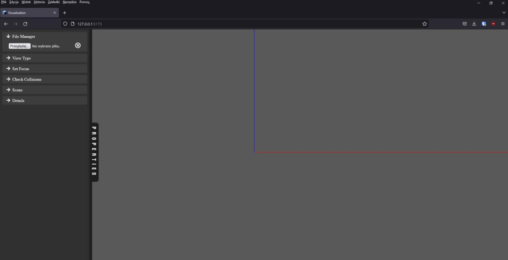
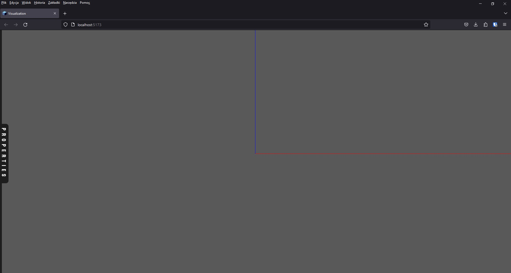

# Visualization

## Overview
The purpose of this project is a visualization of a JSON file from a parser I created as a part of the "Navisecure" project at my university. A JSON file contains details about the university's buildings.

## Technology Stack
- Vue - JavaScript framework for building user interfaces.
- Three.js - JavaScript library used to display 3D graphics in a web browser using WebGL.
- TypeScript - strongly typed programming language that builds on JavaScript.

## Schema of a JSON file: 
```json
[
    {
        "id": "string",
        "name": "string",
        "x": "number",
        "y": "number",
        "z": "number",
        "width": "number",
        "height": "number",
        "depth": "number",
        "center": {
            "x": "number",
            "y": "number",
            "z": "number"
        },
        "rotation": "number",
        "validated": [
            {
                "id": "string",
                "collisionType": "string"
            }
        ]
    }
]
```
An example can be found in "validated.json".

## Project Setup
```sh
npm install
```

## Compile and Hot-Reload for Development

```sh
npm run dev
``` 

## Functionality
1. The user can move around a 3D scene.
2. Show/hide properties toolbar.
3. Show/hide elements of the properties toolbar.
4. Read/remove file.
5. Change view wireframe/solid.
6. Set the focus on a specific element from the list.
7. Check the collision of the focused element.
8. Select elements in the scene from the list.
9. Check the details of the selected element

## Screenshots
### Main view 
After reading a "validated.json" file. The deafult view type is wireframe.


## View type - Solid


## Set focus - drop down list


## View after setting focus on an element


## Check Collison


## View after checking collision
Every collsion has an assigned color:
- Conflict - Red
- IsWithin - Blue
- Contain - Yellow
- Equal - Violet
- Okay - Green



## Selecting element from scene
Selected element from the drop-down list in Scene (Properties toolbar) becomes black.


## Details
After selecting an element from the scene, you can check its details.


## Cleared scene


## Hide properties toolbar


